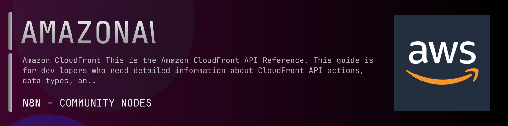

# @n8n-dev/n8n-nodes-amazonaws



[](https://www.npmjs.com/package/@n8n-dev/n8n-nodes-amazonaws)
[](https://opensource.org/licenses/MIT)

---

**Stop writing amazonaws API integrations by hand.**

Every time you connect n8n to amazonaws, you waste hours mapping endpoints, defining parameters, and debugging schemas. You copy-paste from docs, fix edge cases, and pray nothing breaks.

**What if connecting n8n to amazonaws took 5 minutes, not half a day?**

This node gives you **1+ resources** out of the box: **Default**: with full CRUD operations, typed parameters, and zero manual configuration.

---

## What You Get

- **Zero boilerplate**: Resources, operations, and fields are pre-configured and ready to use
- **Full CRUD**: Create, read, update, and delete support where the API allows it
- **Typed parameters**: No more guessing field types
- **Built-in auth**: API key authentication, ready to go
- **Declarative**: Native n8n performance, no custom execute() overhead

---

## Install

```bash
npm install @n8n-dev/n8n-nodes-amazonaws
```

**Or in n8n:**
1. **Settings → Community Nodes → Install**
2. Search: `@n8n-dev/n8n-nodes-amazonaws`
3. Click **Install**

---

## Quick Start

1. Install the node (above)
2. Add credentials: **amazonaws API** → paste your API key
3. Drag the **amazonaws** node into your workflow
4. Pick a resource → pick an operation → done.

That's it. No configuration files. No code. It just works.

---

## Resources

<details>
<summary><b>Default</b> (106 operations)</summary>

- Put Associate Alias 2020 05 31
- Post Copy Distribution 2020 05 31
- Post Create Cache Policy 2020 05 31
- Get List Cache Policies 2020 05 31
- Post Create Cloud Front Origin Access Identity 2020 05 31
- Get List Cloud Front Origin Access Identities 2020 05 31
- Post Create Continuous Deployment Policy 2020 05 31
- Get List Continuous Deployment Policies 2020 05 31
- Post Create Distribution 2020 05 31
- Get List Distributions 2020 05 31
- Post Create Distribution With Tags 2020 05 31
- Post Create Field Level Encryption Config 2020 05 31
- Get List Field Level Encryption Configs 2020 05 31
- Post Create Field Level Encryption Profile 2020 05 31
- Get List Field Level Encryption Profiles 2020 05 31
- Post Create Function 2020 05 31
- Get List Functions 2020 05 31
- Post Create Invalidation 2020 05 31
- Get List Invalidations 2020 05 31
- Post Create Key Group 2020 05 31
- Get List Key Groups 2020 05 31
- Post Create Monitoring Subscription 2020 05 31
- Delete Monitoring Subscription 2020 05 31
- Get Monitoring Subscription 2020 05 31
- Post Create Origin Access Control 2020 05 31
- Get List Origin Access Controls 2020 05 31
- Post Create Origin Request Policy 2020 05 31
- Get List Origin Request Policies 2020 05 31
- Post Create Public Key 2020 05 31
- Get List Public Keys 2020 05 31
- Post Create Realtime Log Config 2020 05 31
- Get List Realtime Log Configs 2020 05 31
- Post Create Response Headers Policy 2020 05 31
- Get List Response Headers Policies 2020 05 31
- Post Create Streaming Distribution 2020 05 31
- Get List Streaming Distributions 2020 05 31
- Post Create Streaming Distribution With Tags 2020 05 31
- Delete Cache Policy 2020 05 31
- Get Cache Policy 2020 05 31
- Put Update Cache Policy 2020 05 31
- Delete Cloud Front Origin Access Identity 2020 05 31
- Get Cloud Front Origin Access Identity 2020 05 31
- Delete Continuous Deployment Policy 2020 05 31
- Get Continuous Deployment Policy 2020 05 31
- Put Update Continuous Deployment Policy 2020 05 31
- Delete Distribution 2020 05 31
- Get Distribution 2020 05 31
- Delete Field Level Encryption Config 2020 05 31
- Get Field Level Encryption 2020 05 31
- Delete Field Level Encryption Profile 2020 05 31
- Get Field Level Encryption Profile 2020 05 31
- Delete Function 2020 05 31
- Put Update Function 2020 05 31
- Delete Key Group 2020 05 31
- Get Key Group 2020 05 31
- Put Update Key Group 2020 05 31
- Delete Origin Access Control 2020 05 31
- Get Origin Access Control 2020 05 31
- Delete Origin Request Policy 2020 05 31
- Get Origin Request Policy 2020 05 31
- Put Update Origin Request Policy 2020 05 31
- Delete Public Key 2020 05 31
- Get Public Key 2020 05 31
- Post Delete Realtime Log Config 2020 05 31
- Delete Response Headers Policy 2020 05 31
- Get Response Headers Policy 2020 05 31
- Put Update Response Headers Policy 2020 05 31
- Delete Streaming Distribution 2020 05 31
- Get Streaming Distribution 2020 05 31
- Get Describe Function 2020 05 31
- Get Cache Policy Config 2020 05 31
- Get Cloud Front Origin Access Identity Config 2020 05 31
- Put Update Cloud Front Origin Access Identity 2020 05 31
- Get Continuous Deployment Policy Config 2020 05 31
- Get Distribution Config 2020 05 31
- Put Update Distribution 2020 05 31
- Get Field Level Encryption Config 2020 05 31
- Put Update Field Level Encryption Config 2020 05 31
- Get Field Level Encryption Profile Config 2020 05 31
- Put Update Field Level Encryption Profile 2020 05 31
- Get Function 2020 05 31
- Get Invalidation 2020 05 31
- Get Key Group Config 2020 05 31
- Get Origin Access Control Config 2020 05 31
- Put Update Origin Access Control 2020 05 31
- Get Origin Request Policy Config 2020 05 31
- Get Public Key Config 2020 05 31
- Put Update Public Key 2020 05 31
- Post Get Realtime Log Config 2020 05 31
- Get Response Headers Policy Config 2020 05 31
- Get Streaming Distribution Config 2020 05 31
- Put Update Streaming Distribution 2020 05 31
- Get List Conflicting Aliases 2020 05 31
- Get List Distributions By Cache Policy ID 2020 05 31
- Get List Distributions By Key Group 2020 05 31
- Get List Distributions By Origin Request Policy ID 2020 05 31
- Post List Distributions By Realtime Log Config 2020 05 31
- Get List Distributions By Response Headers Policy ID 2020 05 31
- Get List Distributions By Web ACL ID 2020 05 31
- Get List Tags For Resource 2020 05 31
- Post Publish Function 2020 05 31
- Post Tag Resource 2020 05 31
- Post Test Function 2020 05 31
- Post Untag Resource 2020 05 31
- Put Update Distribution With Staging Config 2020 05 31
- Put Update Realtime Log Config 2020 05 31

</details>

---

## Why This Node?

**Without this node:**
- Hours of manual API integration
- Copy-pasting from amazonaws docs
- Debugging auth, pagination, error handling
- Maintaining your own client code

**With this node:**
- Install → configure → use. 5 minutes.
- Auto-generated from the official amazonaws OpenAPI spec
- Always up to date when the API changes
- Native n8n performance

---

## Auto-Generated
This node was auto-generated from the official **amazonaws** OpenAPI specification using
[@n8n-dev/n8n-openapi-node-ultimate](https://github.com/kelvinzer0/n8n-openapi-node-ultimate),
then validated against the live API so you get accurate types and real parameters, not guesswork.

When the amazonaws API updates, this node updates too.

---

## Support This Project

If this node saved you hours of work, consider supporting continued development, new APIs, better error handling, and faster updates.

[](https://n8n-code.github.io/membership/#/eyJ0aXRsZSI6IktlZXAgSXQgTW92aW5nIiwiZGVzYyI6Ik9uZSBkZXZlbG9wZXIgYnVpbHQgYSB0b29sIHRoYXQgYXV0by1nZW5lcmF0ZXNcbm44biBub2RlcyBmcm9tIGFueSBPcGVuQVBJIHNwZWMuXG5cbllvdXIgZG9uYXRpb24gZnVuZHMgbmV3IGZlYXR1cmVzLCBtb3JlIEFQSSBzdXBwb3J0LFxuYW5kIGJldHRlciB0b29saW5nIGZvciBldmVyeSBkZXZlbG9wZXIgYWZ0ZXIgeW91LiIsInRhcmdldCI6NTAwMCwiYWRkcmVzc2VzIjp7ImV0aGVyZXVtIjoiMHhmMDU1NWQ0MGRiRkI0ZTNCZjA3MDQ0MjgyQjc4RjJmRTFmNTFFZjcyIiwic29sYW5hIjoiNlpEVk5BYmpZZExEcXo4cGt3VUNHYllaNVV3QlFranB0QzU1Wk5vTFcybVUifSwiZGlzY29yZCI6Imh0dHBzOi8vZGlzY29yZC5nZy9wdERaOGU0aDkzIn0)

---

## License

MIT © [kelvinzer0](https://github.com/n8n-code)
